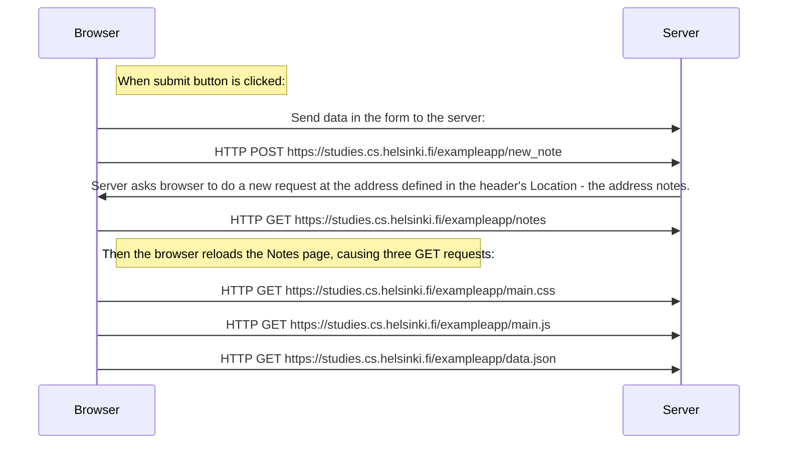

```mermaid
sequenceDiagram
Note right of Browser: When submit button is clicked:
Browser->>Server: Send data in the form to the server:
Browser->>Server: HTTP POST  https://studies.cs.helsinki.fi/exampleapp/new_note
Server->>Browser: Server asks browser to do a new request at the address defined in the header's Location - the address notes.
Browser->>Server: HTTP GET https://studies.cs.helsinki.fi/exampleapp/notes
Note right of Browser: Then the browser reloads the Notes page, causing three GET requests:
Browser->>Server: HTTP GET https://studies.cs.helsinki.fi/exampleapp/main.css
Browser->>Server: HTTP GET https://studies.cs.helsinki.fi/exampleapp/main.js
Browser->>Server: HTTP GET https://studies.cs.helsinki.fi/exampleapp/data.json
```
